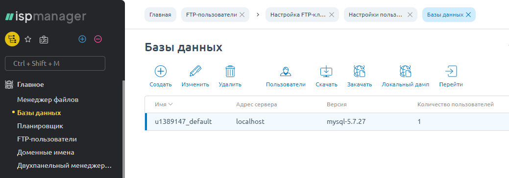

## Экспортируйте существующий сайт {#export-wp-data}

Чтобы экспортировать веб-сайт, управляемый WordPress, достаточно экспортировать содержимое базы данных сайта и создать архив его файлов.



Файл экспорта базы данных (дамп) и архив файлов сайта - это, как правило, всё, что нужно для переноса сайта WordPress. Однако, в отдельных случаях может потребоваться перенести ещё какие-либо элементы, например, периодические задания для системного планировщика `cron` или дополнительные настройки системы программирования `PHP`. Поэтому советуем вам удалять ваш старый сайт **только после того**, как вы убедитесь, что новый сайт во всех отношениях работает так, как надо.



Существует множество способов экспортировать сайт. Выбор наиболее подходящего способа зависит от того, какие средства сделал доступными провайдер услуг хостинга, а также от ваших личных предпочтений. Ниже мы покажем один из вариантов экспорта посредством панели управления хостингом **ISPmanager**, используемой провайдером **REG.RU**.

### Скачайте дамп базы данных сайта {#export-wp-db-ispmanager}

1. Откройте панель управления **ISPmanager**.
1. В меню **Главное** выберите пункт **Базы данных**.
1. Выделите в списке базу данных вашего сайта. Обратите внимание на имя базы данных, указанное в колонке **Имя**, оно потребуется при импорте.
1. Нажмите кнопку **Скачать**.

   

Операция займёт некоторое время. В результате на ваш компьютер будет скачан дамп базы данных сайта - текстовый файл с расширением `.sql`, содержащий команды, необходимые для воссоздания содержимого базы данных сайта. Запомните каталог (папку), куда был скачан файл дампа.



Если после того, как началось скачивание дампа базы данных, кто-то внесёт изменения на сайт, эти изменения уже не попадут в дамп и не будут перенесены на новый сайт. Если потребуется, примите меры, чтобы после начала экспорта никакие изменения на сайт не вносились.



### Скачайте архив файлов сайта {#export-wp-fs-ispmanager}

1. Откройте панель управления **ISPmanager**.
1. В меню **Главное** выберите пункт **Менеджер файлов**.
1. В списке файлов перейдите в каталог (папку), содержащий подкаталоги с файлами ваших сайтов. В нашем примере это каталог `/www`.
1. Выделите каталог, содержащий файлы вашего сайта. Обычно название этого каталога совпадает с именем сайта. В нашем примере это каталог `u1389147.trial.reg.site`.

   

1. Нажмите кнопку **Архив**. Откроется окно диалога **Архивировать**.
1. Выберите тип архива `.tgz` (это традиционный формат сжатого архива файлов в системе Linux).
1. Введите удобное вам имя файла архива. Пример: `my-site`.

   

1. Нажмите **Ok**. Архивирование займёт некоторое время. В результате будет создан файл архива, в нашем примере это файл `my-site.tgz` в каталоге `/www`.

   

1. Выделите в списке файлов только что созданный архив (`my-site.tgz`) и нажмите **Скачать**. В результате на ваш компьютер будет скачан архив файлов сайта. Обратите внимание на размер архива, он может оказаться весьма значительным. Запомните каталог (папку), куда был скачан файл архива.

   



Архив файлов сайта WordPress содержит не только пользовательские файлы, размещённые на вашем сайте, но и файлы, из которых состоит сама CMS WordPress.


